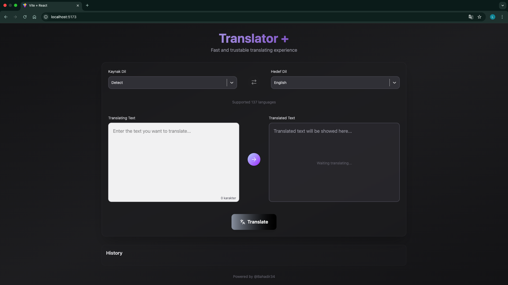
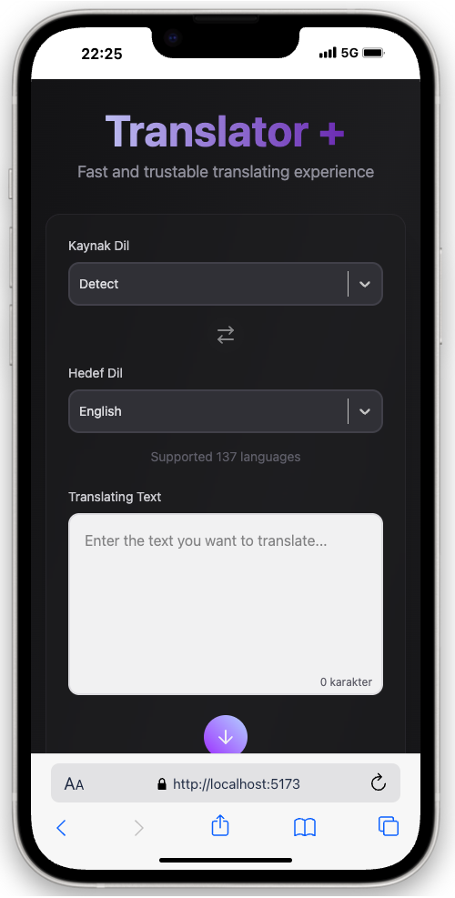
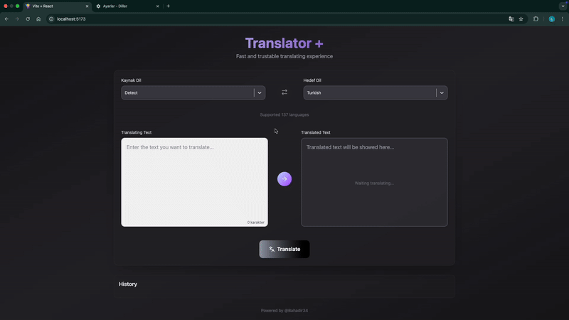

# Translator+

Translator+ 137 farklı dilde çeviri desteği sunan, tamamen **responsive** bir web uygulamasıdır. Uygulama çeviriler için **Deep Translate API** kullanır (erişim RapidAPI üzerinden sağlanır). Arayüz modern tasarım ilkeleriyle hazırlanmış olup, uygulama durumu `Redux Toolkit` ile yönetilmektedir.

## 🔗 API

Deep Translate API (RapidAPI üzerinden erişim):  
https://rapidapi.com/

## 🚀 Özellikler

- 137 dilde çift yönlü çeviri desteği
- Gerçek zamanlı API entegrasyonu (RapidAPI üzerinden)
- Tamamen responsive tasarım (mobil, tablet, masaüstü uyumlu)
- Dil seçimi için gelişmiş dropdown (`react-select`)
- Merkezi durum yönetimi (`Redux Toolkit`)
- HTTP istekleri için `axios` kullanımı

## 🛠️ Kullanılan Teknolojiler ve Kütüphaneler

- **React**
- **Redux Toolkit**
- **Axios**
- **Tailwind CSS**
- **React-Select**

## ⚙️ Ortam Değişkenleri (.env)

Projeyi çalıştırmadan önce kök dizine bir `.env` dosyası oluşturun. `.env.example` dosyasını örnek olarak kullanabilirsiniz.

`.env.example` örneği:

> Not: Vite veya kullandığınız ortama göre değişken isimlerini proje ayarlarına göre uyarlayın (ör. `REACT_APP_` prefix'i gerekiyorsa onu kullanın).

## 🚀 Kurulum ve Çalıştırma

1. Depoyu klonlayın:

```bash
git clone https://github.com/Bahadir34/translator-plus.git
cd translator-plus
```

2. Projeyi Başlatın

```bash
npm run dev
```

## 🖼️ Ekran Görüntüleri ve GIF





_Bu proje eğitim amaçlı geliştirilmiştir, ticari bir amacı yoktur._
